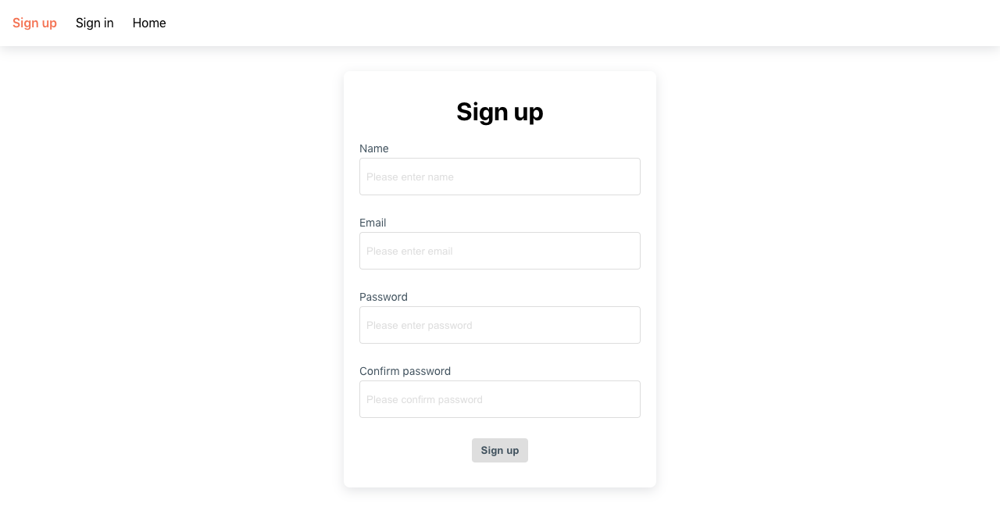
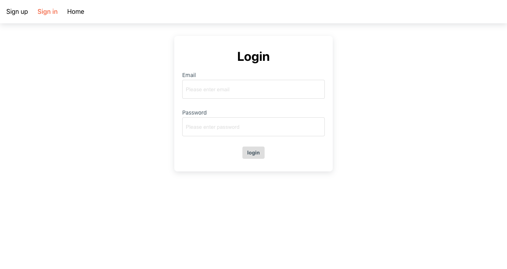
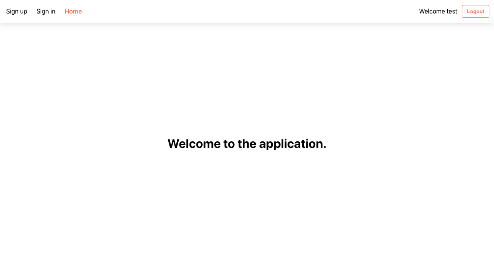

# 🖥️ Authentication App (React)

This is the frontend application of a full-stack authentication system built using **React**.  
The frontend provides a clean and simple interface for **Signup**, **Login**, **Logout**, and navigating to a **protected Home page**.  
It communicates with the backend authentication service using **secure HttpOnly cookies**.

# 📸 Screenshots

### Signup Page


### Login Page


### Home Page



# 🛠️ Installation & Running the Project

## ✔ Recommended Node.js Version
**Node.js ≥ 18.x**  
(Using `nvm` to manage versions is recommended.)


## 1. Clone the Repository
```bash
git clone https://github.com/aliamohamedmamoun/easygenerator-app.git
```
## 2. Install Dependencies
```bash
npm install
```
## 3. Run the development server
```bash
npm start
```
## 4. Building for production
```bash
npm run build
```

# Additional Enhancements (Future Improvements)
#### 1- Improve password Experience (toggle visibility, live password validation).
#### 2- Add Docker support.
#### 3- UI/UX Enhancements (Loading indicators, animation, icons).
#### 4- Unit testing.


